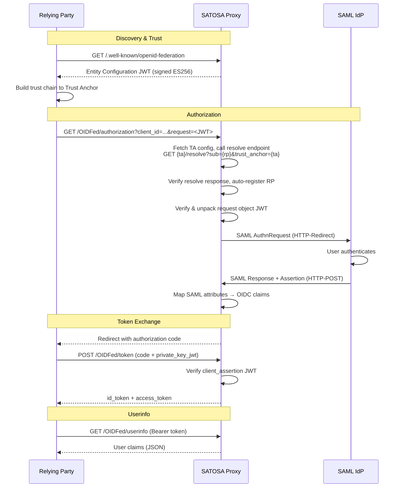

# SATOSA OpenID Federation Frontend

A ready deployment of [SATOSA](https://github.com/IdentityPython/SATOSA)
configured as an **OpenID Federation 1.0 Provider** that bridges upstream SAML2
Identity Providers to downstream OpenID Connect Relying Parties using
federation trust chains for automatic client registration.

## Architecture

### Authentication Flow



SATOSA acts as a protocol translator: RPs speak OpenID Connect (with federation
trust), while the upstream IdP speaks SAML2. The proxy handles all protocol
conversion transparently.

```
RP ──OIDC + Federation──► Frontend Plugin ──► SATOSABase ──► SAML2 Backend ──SAML2──► IdP
```

## Directory Structure

```
satosa-federation/
├── plugin/
│   └── openid_federation.py       # OpenID Federation frontend plugin (~980 lines)
├── etc/
│   ├── proxy_conf.yaml            # Main SATOSA proxy configuration
│   ├── internal_attributes.yaml   # Attribute mapping (SAML ↔ OIDC)
│   ├── idp_metadata.xml           # Upstream SAML IdP metadata
│   ├── keys/
│   │   ├── federation_ec.key      # EC P-256 — signs Entity Configuration JWTs
│   │   ├── oidc_signing.key       # RSA 2048 — signs OIDC id_tokens
│   │   ├── saml_backend.key       # RSA 2048 — signs SAML AuthnRequests
│   │   └── saml_backend.crt       # X.509 cert for SAML SP metadata
│   └── plugins/
│       ├── frontends/
│       │   └── openid_federation.yaml   # Federation frontend config
│       └── backends/
│           └── saml2_backend.yaml       # SAML2 SP backend config
├── Dockerfile                     # Container image (Debian + SATOSA + gunicorn)
├── docker-compose.yml             # Service orchestration
├── Caddyfile                      # TLS reverse proxy config
├── generate_keys.sh               # Generate all cryptographic keys
├── register_sp.sh                 # Register SAML SP metadata with the IdP
├── deploy.sh                      # Deploy to remote server via rsync
└── tests/
    └── test_openid_federation.py  # Plugin tests
```

## Cryptographic Keys

This deployment uses **three separate keys**, each serving a distinct purpose.
This separation follows the OpenID Federation specification requirement that
federation keys (used for trust chain signatures) are independent from protocol
keys (used for OIDC or SAML operations).

### Key Overview

| File | Algorithm | Purpose | Used By |
|------|-----------|---------|---------|
| `federation_ec.key` | EC P-256 (ECDSA) | Signs the Entity Configuration JWT at `/.well-known/openid-federation` | OpenID Federation plugin |
| `oidc_signing.key` | RSA 2048 | Signs OIDC id_tokens and userinfo JWTs issued to RPs | pyop (OIDC Provider library) |
| `saml_backend.key` + `saml_backend.crt` | RSA 2048 + X.509 | Signs SAML AuthnRequests sent to the upstream IdP; included in SP metadata | pysaml2 (SAML library) |

### Why Three Keys?

**Federation key (`federation_ec.key`)** — This EC P-256 key exists purely for
OpenID Federation trust infrastructure. Its public component is published in the
Entity Configuration's top-level `jwks` claim. Trust Anchors and Intermediates
use it to verify that subordinate statements about this OP are consistent.
Federation keys can be rotated independently without affecting OIDC token
signatures or SAML operations.

**OIDC signing key (`oidc_signing.key`)** — This RSA key is used by pyop to sign
the id_tokens and access tokens returned to Relying Parties at the token
endpoint. It is published in the OIDC provider metadata's `jwks_uri` so RPs can
verify token signatures. This is a standard OIDC requirement unrelated to
federation.

**SAML backend key (`saml_backend.key` + `.crt`)** — This RSA key and its
self-signed X.509 certificate are used by pysaml2 for the SAML SP side of the
proxy. The key signs SAML AuthnRequests sent to the upstream IdP. The
certificate is included in the SP metadata XML that the IdP needs to validate
incoming requests. The IdP must have this SP metadata registered (see
`register_sp.sh`).

### Generating Keys

Run the included script to generate all keys at once:

```bash
./generate_keys.sh
```

Or generate them individually:

```bash
mkdir -p etc/keys

# 1. Federation signing key (EC P-256)
#    Used for: Entity Configuration JWT signatures
#    Algorithm: ES256 (ECDSA with P-256 curve and SHA-256)
openssl ecparam -name prime256v1 -genkey -noout -out etc/keys/federation_ec.key

# 2. OIDC signing key (RSA 2048)
#    Used for: id_token and userinfo JWT signatures
#    Algorithm: RS256 (RSASSA-PKCS1-v1_5 with SHA-256)
openssl genrsa -out etc/keys/oidc_signing.key 2048

# 3. SAML backend key + self-signed X.509 certificate
#    Used for: SAML AuthnRequest signatures, SP metadata
#    Certificate CN should match the proxy's hostname
openssl req -x509 -newkey rsa:2048 -nodes \
    -keyout etc/keys/saml_backend.key \
    -out etc/keys/saml_backend.crt \
    -days 365 \
    -subj "/CN=satosa.labb.sunet.se"
```

Set restrictive permissions on the private keys:

```bash
chmod 600 etc/keys/*.key
```

## Configuration

### Main Proxy Config (`etc/proxy_conf.yaml`)

```yaml
BASE: "https://satosa.labb.sunet.se"
COOKIE_STATE_NAME: "SATOSA_STATE"
STATE_ENCRYPTION_KEY: !ENV SATOSA_STATE_ENCRYPTION_KEY
CONTEXT_STATE_DELETE: true

CUSTOM_PLUGIN_MODULE_PATHS:
  - "/opt/satosa/plugin"

INTERNAL_ATTRIBUTES: "/opt/satosa/etc/internal_attributes.yaml"

BACKEND_MODULES:
  - "/opt/satosa/etc/plugins/backends/saml2_backend.yaml"

FRONTEND_MODULES:
  - "/opt/satosa/etc/plugins/frontends/openid_federation.yaml"
```

`CUSTOM_PLUGIN_MODULE_PATHS` tells SATOSA where to find the `openid_federation`
module so it can load the `OpenIDFederationFrontend` class.

### Federation Frontend Config (`etc/plugins/frontends/openid_federation.yaml`)

The `federation` block configures OpenID Federation-specific behavior:

- **`entity_id`**: This OP's entity identifier (URL). Published as `iss` and `sub`
  in the Entity Configuration.
- **`authority_hints`**: List of superior entity IDs (Intermediates or Trust
  Anchors) that vouch for this OP. Used by RPs during trust chain discovery.
- **`trust_anchors`**: Pre-distributed public keys for each Trust Anchor. These
  are the root of trust — the OP only accepts RPs whose trust chains terminate
  at one of these anchors.
- **`signing_key_path`**: Path to the EC P-256 PEM private key for signing
  Entity Configurations.
- **`entity_configuration_lifetime`**: How long (in seconds) before the Entity
  Configuration JWT expires.
- **`rp_cache_ttl`**: How long to cache a resolved RP's metadata before
  re-resolving its trust chain.

### Attribute Mapping (`etc/internal_attributes.yaml`)

Maps attribute names between SAML (from the upstream IdP) and OpenID Connect
(to the downstream RP):

| Internal Name | SAML Attribute | OIDC Claim |
|--------------|----------------|------------|
| `mail` | `email`, `emailAddress`, `mail` | `email` |
| `givenname` | `givenName` | `given_name` |
| `surname` | `sn`, `surname` | `family_name` |
| `name` | `cn` | `name` |
| `displayname` | `displayName` | `nickname` |
| `edupersonprincipalname` | `eduPersonPrincipalName` | `sub` |

The `user_id_from_attrs` setting determines which attribute is used as the
primary user identifier. This deployment uses `edupersonprincipalname`.

## Deployment

### Prerequisites

- Docker and Docker Compose
- A domain with DNS pointing to your server
- Caddy (or another TLS-terminating reverse proxy) on the host

### Build and Run

```bash
# Generate keys (first time only)
./generate_keys.sh

# Set the state encryption key
export SATOSA_STATE_ENCRYPTION_KEY="$(openssl rand -hex 32)"

# Build and start
docker compose up --build -d
```

The container runs gunicorn on port 8080, mapped to host port 8088. Caddy
handles TLS termination and reverse proxies to port 8088.

### Register SP with IdP

The upstream SAML IdP needs to know about SATOSA's SP metadata. After the
container is running:

```bash
./register_sp.sh
```

This generates the SP metadata inside the running container (using
`satosa-saml-metadata`), extracts it, and uploads it to the IdP via HTTP PUT.

### Deploy to Remote Server

```bash
./deploy.sh
```

This uses rsync to sync the configuration and code to the remote server at
`debian@89.45.236.13:./satosa/`.

## Plugin Details

### OpenID Federation Frontend (`plugin/openid_federation.py`)

The plugin extends SATOSA's `OpenIDConnectFrontend` (which wraps the pyop
library) to support OpenID Federation 1.0. It adds three main capabilities:

#### 1. Entity Configuration Endpoint

Serves a self-signed JWT at `/.well-known/openid-federation` containing:
- The OP's entity identifier (`iss`, `sub`)
- Federation public key (`jwks`) — the EC P-256 key
- Authority hints pointing to superior entities
- Full OIDC Provider metadata under `metadata.openid_provider`
- Organization info under `metadata.federation_entity`
- Trust marks (if configured)

The JWT is signed with the federation EC key using ES256, with the header
`typ: entity-statement+jwt` as required by the OpenID Federation spec.

#### 2. Automatic Client Registration

When an unknown RP sends an authorization request, instead of rejecting it, the
plugin resolves the RP's trust chain by delegating to the Trust Anchor's resolve
endpoint (OpenID Federation 1.0 Section 8.3.1):

1. For each configured Trust Anchor, fetch its Entity Configuration from
   `{ta_id}/.well-known/openid-federation`
2. Verify the TA's Entity Configuration against pre-distributed keys
3. Find the TA's `federation_resolve_endpoint` in its `federation_entity` metadata
4. Call `GET {resolve_endpoint}?sub={rp_id}&trust_anchor={ta_id}` to resolve the
   RP's trust chain and metadata (with policies already applied by the TA)
5. Verify the resolve response JWT against the TA's keys
6. Extract the resolved metadata and register the RP in pyop's client database

Resolved metadata is cached per-RP with a configurable TTL.

#### 3. pyop Compatibility Workarounds

The pyop library has limitations that don't align with federation requirements:

**private_key_jwt authentication:** pyop only supports `client_secret_basic`,
`client_secret_post`, and `none`. Federation RPs use `private_key_jwt` (RFC
7523). The plugin works around this by:
- Registering federation clients with `token_endpoint_auth_method: "none"` in pyop
- Intercepting token requests to verify the `client_assertion` JWT using the RP's
  federation JWKS
- Stripping the assertion before passing to pyop

**Request object JWTs (RFC 9101):** Federation RPs send authorization parameters
inside a signed JWT in the `request` parameter. pyop would need the RP's keys in
its keyjar to verify these. The plugin verifies and unpacks request objects
itself, replacing the JWT with plain parameters before delegating to pyop.

## Endpoints

| Path | Method | Description |
|------|--------|-------------|
| `/.well-known/openid-federation` | GET | Entity Configuration (signed JWT) |
| `/.well-known/openid-configuration` | GET | Standard OIDC discovery metadata |
| `/OIDFed/authorization` | GET | OIDC authorization endpoint |
| `/OIDFed/token` | POST | OIDC token endpoint (supports private_key_jwt) |
| `/OIDFed/userinfo` | GET | OIDC userinfo endpoint |
| `/Saml2/acs/post` | POST | SAML Assertion Consumer Service (receives IdP responses) |
| `/Saml2/acs/redirect` | GET | SAML ACS (HTTP-Redirect binding) |
| `/Saml2/proxy_saml2_backend.xml` | GET | SAML SP metadata |

## Trust Anchors

This deployment is configured to trust two federation Trust Anchors:

| Trust Anchor | Federation |
|-------------|------------|
| `https://realta.labb.sunet.se` | SUNET lab federation |
| `https://ta.tiime2026.aai.garr.it` | GARR TIIME 2026 federation |

RPs whose trust chains resolve to either of these anchors will be automatically
accepted and registered.

## Dependencies

The Docker image installs:
- **SATOSA** — the proxy framework
- **gunicorn** — WSGI server
- **requests** — HTTP client (for federation trust chain resolution)
- **cryptography** — EC key loading
- **xmlsec1** — XML signature verification (for SAML)

The federation plugin additionally relies on:
- **jwkest** — JWT signing and verification (bundled with SATOSA via pyoidc)
- **pyop** — OpenID Provider (inherited via SATOSA's OpenIDConnectFrontend)
- **pysaml2** — SAML2 SP (used by the SAML backend)
