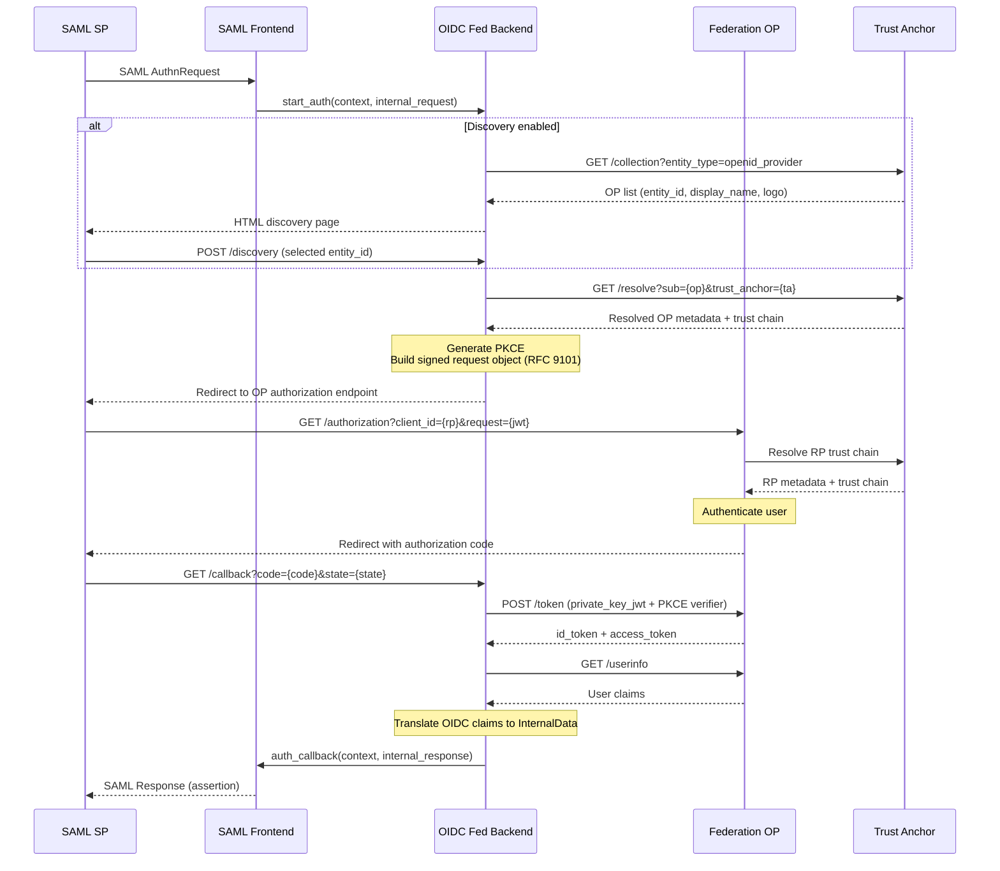
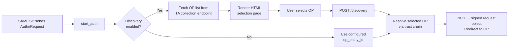
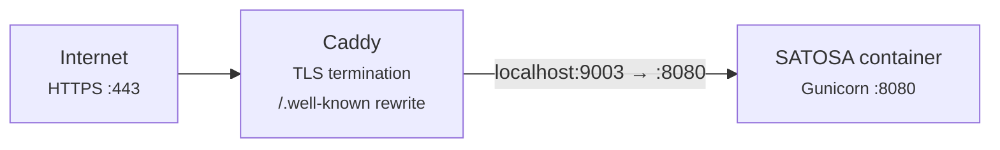
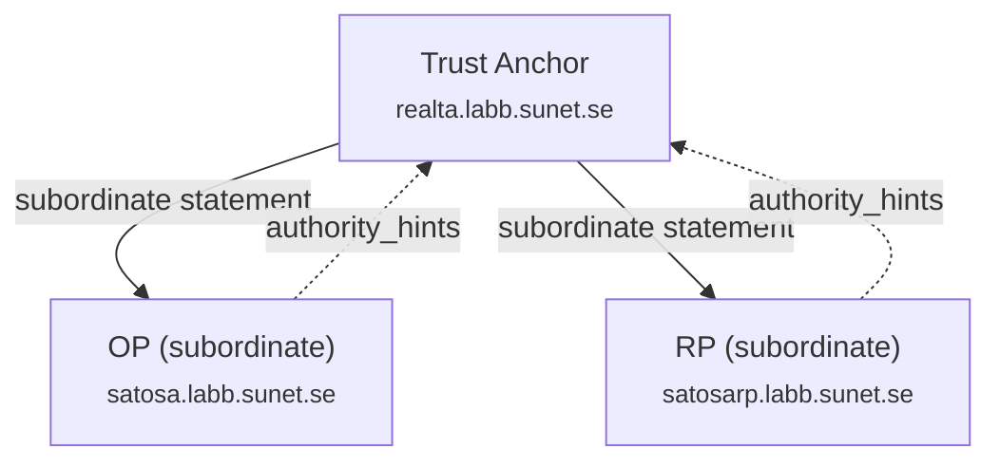

# SATOSA RP Proxy — OpenID Federation Backend

A SATOSA proxy deployment that bridges SAML Service Providers to OpenID Federation OPs. The SAML frontend presents an IdP to downstream SAML SPs, while the OpenID Federation backend acts as a federation-aware RP connecting to upstream OPs via trust chain resolution.

### Request flow



## Directory structure

```
rp/
├── Caddyfile                          # Caddy reverse proxy config
├── deploy.sh                          # rsync deployment script
├── docker-compose.yml                 # Docker Compose service definition
├── Dockerfile                         # Container image build
├── generate_keys.sh                   # Key generation script
├── README.md                          # This file
└── etc/
    ├── proxy_conf.yaml                # SATOSA proxy configuration
    ├── internal_attributes.yaml       # Attribute mapping (OIDC ↔ SAML)
    ├── keys/                          # Generated keys (not committed)
    │   ├── rp_federation_ec.key       # EC P-256 federation signing key
    │   ├── saml_frontend.key          # RSA key for SAML frontend
    │   └── saml_frontend.crt          # Self-signed cert for SAML frontend
    └── plugins/
        ├── backends/
        │   └── openid_federation_backend.yaml
        └── frontends/
            └── saml2_frontend.yaml
```

The `plugin/` directory (containing `openid_federation.py` and `openid_federation_backend.py`) lives at `satosa-federation/plugin/` and is synced separately during deployment.

## Keys

Two separate key pairs are used:

| Key | Type | Purpose |
|-----|------|---------|
| `rp_federation_ec.key` | EC P-256 | Federation Entity Configuration signing, OIDC request objects, private_key_jwt client assertions |
| `saml_frontend.key` / `.crt` | RSA 2048 | SAML IdP frontend — signs SAML assertions |

Generate them on the server:

```bash
cd ~/satosarp
bash generate_keys.sh
```

This creates `etc/keys/` with proper permissions (600 on private keys).

## Deployment

### Prerequisites

- Server with Docker and Docker Compose
- Caddy as reverse proxy (handles TLS via automatic HTTPS)
- DNS record for `satosarp.labb.sunet.se` pointing to the server
- The RP entity (`https://satosarp.labb.sunet.se`) registered as a subordinate with the Trust Anchor

### 1. Deploy files to server

From the `rp/` directory on your local machine:

```bash
bash deploy.sh
```

This rsyncs the config files, Dockerfile, and plugin directory to `~/satosarp` on the server (`debian@89.45.236.13`).

### 2. Generate keys (first time only)

```bash
ssh debian@89.45.236.13 'cd ~/satosarp && bash generate_keys.sh'
```

### 3. Create `.env` file

```bash
ssh debian@89.45.236.13 'cat > ~/satosarp/.env << EOF
SATOSA_STATE_ENCRYPTION_KEY=$(python3 -c "import secrets; print(secrets.token_hex(32))")
EOF'
```

### 4. Add Caddy config

Copy the Caddyfile content to the server's Caddy config directory:

```bash
sudo cp ~/satosarp/Caddyfile /etc/caddy/conf.d/satosarp.caddy
sudo systemctl reload caddy
```

The Caddyfile does two things:
- Rewrites `/.well-known/openid-federation` to the backend's entity configuration endpoint
- Reverse proxies all traffic to the SATOSA container on `localhost:9003`

### 5. Build and start

```bash
cd ~/satosarp
docker compose up --build -d
```

### 6. Verify

Check the container logs:

```bash
docker compose logs -f
```

You should see SATOSA start up, resolve the OP metadata via the Trust Anchor, and begin listening.

Test the endpoints:

```bash
# Federation entity configuration (should return a JWT)
curl -s https://satosarp.labb.sunet.se/.well-known/openid-federation | head -c 80

# SAML metadata (should return XML)
curl -s https://satosarp.labb.sunet.se/Saml2IDP/proxy.xml | head -c 200
```

## Configuration

### `etc/proxy_conf.yaml`

```yaml
BASE: "https://satosarp.labb.sunet.se"
COOKIE_STATE_NAME: "SATOSA_STATE"
STATE_ENCRYPTION_KEY: !ENV SATOSA_STATE_ENCRYPTION_KEY
CONTEXT_STATE_DELETE: true
CUSTOM_PLUGIN_MODULE_PATHS:
  - "/opt/satosa/plugin"
INTERNAL_ATTRIBUTES: "/opt/satosa/etc/internal_attributes.yaml"
BACKEND_MODULES:
  - "/opt/satosa/etc/plugins/backends/openid_federation_backend.yaml"
FRONTEND_MODULES:
  - "/opt/satosa/etc/plugins/frontends/saml2_frontend.yaml"
```

`STATE_ENCRYPTION_KEY` is read from the environment variable set in `.env`.

### Backend: `openid_federation_backend.yaml`

```yaml
module: openid_federation_backend.OpenIDFederationBackend
name: OIDFedRP
config:
  op_entity_id: "https://satosa.labb.sunet.se"
  entity_id: "https://satosarp.labb.sunet.se"
  scope: "openid email profile"

  federation:
    signing_key_path: /opt/satosa/etc/keys/rp_federation_ec.key
    signing_key_id: rp-fed-key-1
    signing_algorithm: ES256
    authority_hints:
      - "https://realta.labb.sunet.se"
    trust_anchors:
      "https://realta.labb.sunet.se":
        keys:
          - kty: RSA
            alg: RS256
            use: sig
            kid: "jx4OZapVWSZAbLJGt7hFfI-khthAXwgFac7P9HQ3A60"
            e: "AQAB"
            n: "ow4cllR_Pbvh35UBhiMP..."
    entity_configuration_lifetime: 86400
    organization_name: "SATOSA RP Proxy"
```

Key settings:

| Setting | Description |
|---------|-------------|
| `op_entity_id` | Default OP to use (required unless discovery is enabled) |
| `entity_id` | This RP's entity identifier |
| `scope` | OIDC scopes to request |
| `federation.signing_key_path` | Path to the EC P-256 private key |
| `federation.authority_hints` | Entity IDs of immediate superiors in the federation |
| `federation.trust_anchors` | Map of Trust Anchor entity IDs to their public JWK(s) |
| `federation.entity_configuration_lifetime` | TTL in seconds for the Entity Configuration JWT |
| `federation.trust_marks` | Array of trust mark objects to include in Entity Configuration |

### Trust Marks

Trust marks are pre-signed JWTs issued by a Trust Mark Issuer asserting that this entity complies with specific requirements (e.g., certification level, interoperability). They are included in the Entity Configuration JWT so that other federation participants can verify them.

```yaml
federation:
  # ... other federation config ...
  trust_marks:
    - id: "https://trust-mark-issuer.example.com/marks/certified-rp"
      trust_mark: "eyJhbGciOiJFUzI1NiIsInR5cCI6InRydXN0LW1hcmsrand..."
    - id: "https://another-issuer.example.com/marks/security-level-2"
      trust_mark: "eyJhbGciOiJFUzI1NiIsInR5cCI6InRydXN0LW1hcmsrand..."
```

Each entry requires:
- **`id`**: URI identifying the trust mark type
- **`trust_mark`**: The pre-signed JWT string obtained from the Trust Mark Issuer

When configured, the trust marks appear in the `trust_marks` claim of the Entity Configuration JWT served at `/.well-known/openid-federation`. If no trust marks are configured (empty list or omitted), the claim is not included.

### OP Discovery

To let users choose from all OPs in the federation, enable discovery:

```yaml
config:
  # op_entity_id is optional when discovery is enabled
  entity_id: "https://satosarp.labb.sunet.se"
  scope: "openid email profile"

  discovery:
    enable: true
    collection_endpoint: "https://realta.labb.sunet.se/collection"
    cache_ttl: 3600
    page_title: "Select Identity Provider"
```

When enabled:
- `start_auth()` renders an HTML page listing all OPs from the Trust Anchor's collection endpoint
- User selects an OP, which POSTs to `/{name}/discovery`
- The selected OP's metadata is resolved via trust chain and cached
- Authorization proceeds with that OP



The collection endpoint is queried with `?entity_type=openid_provider` and should return JSON with an `entities` array containing `entity_id` and optional `ui_infos` (display names, logos).

### Frontend: `saml2_frontend.yaml`

Standard SATOSA SAMLFrontend configured as an IdP. The entity ID is `https://satosarp.labb.sunet.se/Saml2IDP/proxy.xml`.

SSO endpoints:
- HTTP-Redirect: `https://satosarp.labb.sunet.se/OIDFedRP/Saml2IDP/sso/redirect`
- HTTP-POST: `https://satosarp.labb.sunet.se/OIDFedRP/Saml2IDP/sso/post`

Note: SATOSA prefixes frontend endpoints with the backend name (`OIDFedRP/`), so the full SSO URL includes the backend name.

### Attribute mapping

`internal_attributes.yaml` maps between OIDC claims and SAML attributes:

| Internal name | OIDC claim | SAML attribute |
|---------------|------------|----------------|
| `mail` | `email` | `email`, `emailAddress`, `mail` |
| `givenname` | `given_name` | `givenName` |
| `surname` | `family_name` | `sn`, `surname` |
| `displayname` | `nickname` | `displayName` |
| `name` | `name` | `cn` |
| `edupersonprincipalname` | `sub` | `eduPersonPrincipalName` |

The user ID is derived from `edupersonprincipalname` (maps to OIDC `sub`).

## Connecting a SAML SP

To configure a SAML SP (e.g., django-allauth) to use this proxy as its IdP:

```python
# Django settings.py example (django-allauth SAML provider)
SOCIALACCOUNT_PROVIDERS = {
    "saml": {
        "APPS": [{
            "provider_id": "satosa-rp",
            "name": "SATOSA RP Proxy",
            "client_id": "satosa-rp",
            "settings": {
                "idp": {
                    "entity_id": "https://satosarp.labb.sunet.se/Saml2IDP/proxy.xml",
                    "sso_url": "https://satosarp.labb.sunet.se/OIDFedRP/Saml2IDP/sso/redirect",
                    "x509cert": "<contents of etc/keys/saml_frontend.crt, base64 only, no PEM headers>",
                },
                "sp": {
                    "entity_id": "https://samlsp.labb.sunet.se",
                },
                "attribute_mapping": {
                    "uid": "urn:oid:0.9.2342.19200300.100.1.1",
                    "email": "urn:oid:0.9.2342.19200300.100.1.3",
                    "first_name": "urn:oid:2.5.4.42",
                    "last_name": "urn:oid:2.5.4.4",
                },
            },
        }]
    }
}
```

To get the certificate value (base64 only, no PEM headers):

```bash
grep -v '^-----' ~/satosarp/etc/keys/saml_frontend.crt | tr -d '\n'
```

## Registered endpoints

| URL path | Handler | Description |
|----------|---------|-------------|
| `/.well-known/openid-federation` | Caddy rewrite → `OIDFedRP/entity-configuration` | Federation Entity Configuration |
| `OIDFedRP/entity-configuration` | `entity_configuration_endpoint()` | Self-signed JWT with RP metadata |
| `OIDFedRP/callback` | `response_endpoint()` | OIDC authorization code callback |
| `OIDFedRP/discovery` | `discovery_endpoint()` | OP selection (POST, discovery mode only) |
| `Saml2IDP/proxy.xml` | SAMLFrontend | SAML IdP metadata |
| `OIDFedRP/Saml2IDP/sso/redirect` | SAMLFrontend | SAML SSO (HTTP-Redirect binding) |
| `OIDFedRP/Saml2IDP/sso/post` | SAMLFrontend | SAML SSO (HTTP-POST binding) |

## Docker details



The container runs Gunicorn serving the SATOSA WSGI app on port 8080 (mapped to `127.0.0.1:9003` on the host). Caddy handles TLS termination and proxies to it.

Volumes mount `./etc` and `./plugin` so config and code changes can be applied without rebuilding:

```bash
# After editing config or plugin code:
docker compose restart
```

To rebuild (e.g., after changing Dockerfile or Python dependencies):

```bash
docker compose up --build -d
```

## Trust Anchor registration



The RP must be registered as a subordinate entity with the Trust Anchor for the end-to-end flow to work. The Trust Anchor needs:

1. The RP's entity ID: `https://satosarp.labb.sunet.se`
2. The RP's federation public key (from the Entity Configuration at `/.well-known/openid-federation`)

Without this registration, OPs will fail to resolve the RP's trust chain and reject its authorization requests.

## Updating

After making changes to the plugin or config locally:

```bash
# From the rp/ directory
bash deploy.sh

# Then on the server
ssh debian@89.45.236.13 'cd ~/satosarp && docker compose restart'
```

If you changed the Dockerfile or Python dependencies:

```bash
ssh debian@89.45.236.13 'cd ~/satosarp && docker compose up --build -d'
```
